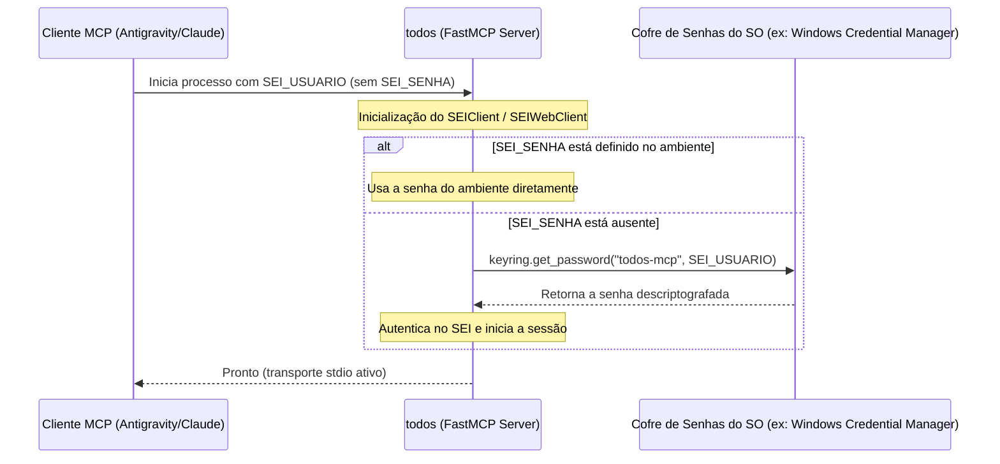

# RFC 0002 — Armazenamento Seguro de Credenciais via Keyring do Sistema Operacional

**Status**: Em Discussão  
**Data**: 2026-06-11  
**Autores**: Franklin Baldo (com Claude Code)  

## 1. Problema

O `todos` (MCP Server para o SEI) requer autenticação de usuário e senha (`SEI_USUARIO` e `SEI_SENHA`). Atualmente, o padrão de configuração do Claude Desktop e do Antigravity IDE é armazenar essas variáveis de ambiente em texto plano no arquivo de configuração global (`mcp_config.json` ou `claude_desktop_config.json`).

Isso apresenta um risco de segurança crítico:
1. **Vazamento local**: Qualquer processo ou script executando na conta do usuário pode ler o arquivo de configuração e roubar a senha do SEI.
2. **Exposição em backups**: Backups não criptografados da pasta home expõem a credencial.
3. **Falta de compliance**: Organizações públicas ou privadas geralmente proíbem o armazenamento de senhas do SEI (que dão acesso a dados sigilosos e assinaturas com validade jurídica) em arquivos de texto plano.

## 2. Objetivo

Eliminar a necessidade de salvar a senha do SEI em texto plano no `mcp_config.json` por meio da integração nativa com o **gerenciador de credenciais do sistema operacional**, utilizando a biblioteca multiplataforma `keyring`.

Especificamente:
1. Dar suporte à leitura da senha diretamente do cofre de credenciais do sistema operacional (Windows Credential Manager, macOS Keychain, ou Secret Service API no Linux).
2. Atualizar o script instalador (`setup_claude.py`) para registrar a credencial com segurança no cofre de senhas do sistema no momento da instalação e omitir a senha do arquivo de configuração JSON.
3. Manter compatibilidade com a leitura tradicional de `SEI_SENHA` a partir do ambiente de execução (para containers, execução remota ou deploys CI/CD).

## 3. Fundamento Técnico

A biblioteca Python `keyring` fornece uma interface unificada para acessar os serviços de armazenamento seguro nativos de cada sistema operacional:
*   **Windows**: Windows Credential Manager (Credential Locker)
*   **macOS**: Apple Keychain
*   **Linux**: Freedesktop.org Secret Service API (via D-Bus) ou KWallet

### Fluxo de Funcionamento Proposto



## 4. Proposta

### 4.1. Adicionar Dependência
Adicionar `keyring` ao `project.dependencies` no `pyproject.toml` para garantir que esteja sempre instalado.

```toml
dependencies = [
    ...
    "keyring>=25.0.0",
]
```

### 4.2. Alteração na leitura de configurações (`sei_client.py` & `sei_web_client.py`)
No construtor das classes de cliente do SEI, caso a senha não seja fornecida explicitamente em `kwargs` ou na variável de ambiente `SEI_SENHA`, o cliente usará o `keyring` para recuperá-la:

```python
import keyring

class SEIClient:
    def __init__(self, **kwargs):
        self.base_url = kwargs.get("sei_url", os.environ.get("SEI_URL", "")).rstrip("/")
        self._usuario = kwargs.get("sei_usuario", os.environ.get("SEI_USUARIO", ""))
        
        # Recupera senha
        senha = kwargs.get("sei_senha", os.environ.get("SEI_SENHA", ""))
        if not senha and self._usuario:
            try:
                senha = keyring.get_password("todos-mcp", self._usuario)
                if senha:
                    logger.info("Senha recuperada com segurança do chaveiro do sistema.")
            except Exception as e:
                logger.warning(f"Não foi possível ler a senha do keyring: {e}")
                
        self._senha = senha
        ...
```

*(Mesmo padrão aplicado no construtor do `SEIWebClient`).*

### 4.3. Alterações no Instalador (`setup_claude.py`)
O script `setup_claude.py` será modificado para perguntar se o usuário deseja salvar a senha com segurança.

1. **Prompt de Senha**:
   Se o usuário confirmar que deseja usar o armazenamento seguro (padrão):
   ```python
   import keyring
   
   # ... dentro do script ...
   if usar_keyring:
       try:
           keyring.set_password("todos-mcp", sei_usuario, sei_senha)
           info("Senha guardada com sucesso no chaveiro do sistema.")
       except Exception as e:
           error(f"Falha ao salvar no chaveiro do sistema: {e}")
           # Fallback para texto plano se falhar
   ```

2. **Geração do JSON de Configuração**:
   Ao gerar a entrada no `mcp_config.json`, a chave `SEI_SENHA` será **totalmente omitida** do objeto `env`:
   ```json
   {
     "mcpServers": {
       "todos": {
         "command": "c:\\Users\\frank\\workspace\\todos\\.venv\\Scripts\\todos.exe",
         "env": {
           "SEI_USUARIO": "76450694220",
           "SEI_ORGAO": "0",
           "SEI_VERIFY_SSL": "true",
           "SEI_WEB_URL": "https://sei.sistemas.ro.gov.br"
         }
       }
     }
   }
   ```

## 5. Variáveis de Ambiente

| Variável | Obrigatoriedade | Descrição |
|---|---|---|
| `SEI_USUARIO` | Obrigatória | Usada como identificador/username para busca da senha no `keyring`. |
| `SEI_SENHA` | Opcional | Se fornecida no ambiente, ignora o `keyring`. Essencial para ambientes não-interativos ou remotos. |

## 6. Alternativas Consideradas

1. **Wrapper scripts locais (`.bat` / `.ps1`)**:
   Rejeitado por não ser multiplataforma nativo. Exigiria scripts diferentes por sistema operacional e lógica complexa para decodificar credenciais de formas específicas em cada shell.
2. **Pedir a senha de forma interativa pelo terminal ao iniciar o MCP**:
   Inviável porque o cliente MCP roda o processo do servidor em background (via transporte stdio) e não há uma forma amigável do modelo ou do usuário interagir com o stdin/stdout bruto fora do fluxo do protocolo.

## 7. Riscos e Mitigações

*   **Bloqueio de keyring Headless (Linux sem GUI)**:
    *   *Risco*: No Linux sem interface gráfica, o keyring pode pedir autenticação via D-Bus e falhar/travar.
    *   *Mitigação*: O código captura exceções ao interagir com o `keyring` e faz fallback silencioso. Usuários em servidores Linux sem GUI podem simplesmente passar a senha pela variável de ambiente `SEI_SENHA`.
*   **Acesso não autorizado ao keyring**:
    *   *Risco*: Outro script python rodando no mesmo usuário pode ler a senha usando `keyring.get_password("todos-mcp", usuario)`.
    *   *Mitigação*: Este é o limite padrão do modelo de segurança dos sistemas operacionais (isolamento por conta de usuário). É ordens de grandeza mais seguro do que um arquivo de configuração legível em texto plano por qualquer programa/visualizador.

## 8. Métricas de Sucesso

1. Instalação e execução do MCP sem que a senha do SEI apareça em texto plano em nenhum arquivo JSON de configuração local.
2. Suporte out-of-the-box para Windows, macOS e Linux desktop.
